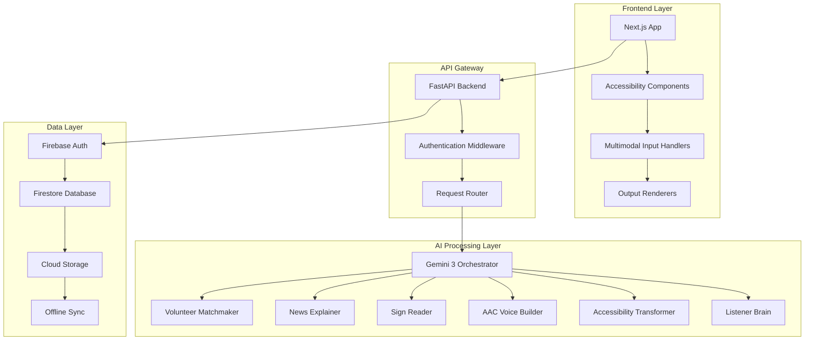

# Design Document: UNSAID/UNHEARD

## Overview

UNSAID/UNHEARD is an accessibility-first super-app that empowers disabled and neurodivergent users through multimodal communication, community connection, and accessible content consumption. The system leverages Gemini 3 multimodal AI to seamlessly translate between voice, text, camera, and sign language, ensuring users can express themselves and consume information in their preferred format.

### Core Design Principles

1. **Accessibility First**: Every feature is designed with accessibility as the foundation, not an afterthought
2. **User Adaptation**: The system adapts to the user's needs rather than requiring users to adapt to the system
3. **Non-Judgmental Environment**: No pressure, correction, or performance expectations
4. **Multimodal Flexibility**: Support for voice, text, icons, sign language, and camera input/output
5. **Safe Presence**: Creating a welcoming space where users feel heard and validated

## Architecture

### High-Level System Architecture



### Technology Stack

- **Frontend**: Next.js 14 with TypeScript, Tailwind CSS, ARIA compliance
- **Backend**: FastAPI with Python 3.11+
- **Database**: Firebase Firestore for real-time data, Firebase Storage for media
- **Authentication**: Firebase Auth with accessibility-focused flows
- **AI**: Gemini 3 Pro/Flash with specialized prompt engineering
- **Deployment**: Vercel (frontend), Google Cloud Run (backend)
- **Real-time**: WebSocket connections for live features (captions, sessions)

## Components and Interfaces

### 1. Accessibility Foundation Layer

#### AccessibilityProvider Component
```typescript
interface AccessibilityPreferences {
  inputModes: ('voice' | 'text' | 'icons' | 'sign' | 'camera')[];
  outputModes: ('audio' | 'captions' | 'easy-read' | 'sign')[];
  visualSettings: {
    fontSize: 'small' | 'medium' | 'large' | 'extra-large';
    contrast: 'normal' | 'high' | 'extra-high';
    colorScheme: 'light' | 'dark' | 'auto';
  };
  motorSettings: {
    touchTargetSize: 'standard' | 'large' | 'extra-large';
    gestureTimeout: number;
    dwellTime: number;
  };
  cognitiveSettings: {
    simplifiedUI: boolean;
    reducedMotion: boolean;
    focusIndicators: 'standard' | 'enhanced';
  };
}
```

#### Universal Input Handler
```typescript
interface MultimodalInput {
  type: 'voice' | 'text' | 'icons' | 'sign' | 'camera';
  content: string | AudioBlob | ImageBlob | IconSequence;
  confidence?: number;
  timestamp: Date;
  metadata?: Record<string, any>;
}

interface InputProcessor {
  process(input: MultimodalInput): Promise<ProcessedInput>;
  validate(input: MultimodalInput): boolean;
  fallback(input: MultimodalInput): Promise<ProcessedInput>;
}
```

### 2. Core Communication Components

#### AAC Voice Builder
```typescript
interface AACVoiceBuilder {
  buildSentence(icons: IconSequence, phrases: string[]): Promise<{
    short: string;
    medium: string;
    long: string;
    confidence: number;
  }>;
  
  speakAloud(text: string, voice: VoiceSettings): Promise<void>;
  
  getQuickPhrases(context: ConversationContext): Promise<string[]>;
  
  saveCustomPhrase(phrase: string, icons: IconSequence): Promise<void>;
}

interface ConversationMode {
  startSession(): Promise<SessionId>;
  addQuickReply(phrase: string): void;
  getContextualSuggestions(): Promise<string[]>;
  endSession(): Promise<ConversationSummary>;
}
```

#### Speech-to-Caption Engine
```typescript
interface CaptionEngine {
  startLiveCaption(): Promise<CaptionSession>;
  
  processAudio(audio: AudioStream): Promise<{
    text: string;
    speaker: SpeakerLabel;
    confidence: number;
    timestamp: number;
  }>;
  
  getSuggestedReplies(context: string[]): Promise<string[]>;
  
  exportCaptionHistory(): Promise<CaptionExport>;
}

interface SpeakerLabel {
  id: string;
  name?: string;
  color: string;
}
```

#### Sign Language Processor
```typescript
interface SignProcessor {
  recognizeSign(videoClip: VideoBlob): Promise<{
    text: string;
    confidence: number;
    timestamps: TimeSegment[];
    alternativeInterpretations: string[];
  }>;
  
  generateSignCards(text: string): Promise<SignCard[]>;
  
  createSignClipTokens(vocabulary: string[]): Promise<SignToken[]>;
}

interface SignCard {
  phrase: string;
  visualCues: string[];
  difficulty: 'basic' | 'intermediate' | 'advanced';
  relatedSigns: string[];
}
```

### 3. Community Platform Components

#### Post Creation System
```typescript
interface PostCreator {
  createFromText(content: string): Promise<Post>;
  createFromVoice(audio: AudioBlob): Promise<Post>;
  createFromAAC(icons: IconSequence): Promise<Post>;
  createFromSign(video: VideoBlob): Promise<Post>;
  createFromCamera(image: ImageBlob): Promise<Post>;
}

interface Post {
  id: string;
  authorId: string;
  originalContent: MultimodalContent;
  accessibleVersions: {
    audio: AudioBlob;
    captions: string;
    easyRead: string;
    translation?: string;
  };
  visibility: 'public' | 'supporters' | 'private';
  reactions: Reaction[];
  comments: Comment[];
  createdAt: Date;
}
```

#### Community Safety System
```typescript
interface SafetyManager {
  moderateContent(content: string | ImageBlob): Promise<ModerationResult>;
  
  reportContent(postId: string, reason: string): Promise<void>;
  
  blockUser(userId: string): Promise<void>;
  
  enableCalmMode(userId: string): Promise<void>;
  
  getContentGuidelines(): Promise<AccessibleGuidelines>;
}

interface ModerationResult {
  approved: boolean;
  flags: string[];
  confidence: number;
  humanReviewRequired: boolean;
}
```

### 4. Volunteer Matching System

#### Volunteer Matcher
```typescript
interface VolunteerMatcher {
  createHelpRequest(request: HelpRequest): Promise<RequestId>;
  
  findMatches(request: HelpRequest): Promise<VolunteerMatch[]>;
  
  acceptMatch(requestId: string, volunteerId: string): Promise<SessionRoom>;
  
  rejectMatch(requestId: string, volunteerId: string): Promise<void>;
}

interface HelpRequest {
  category: 'digital-skills' | 'communication' | 'career' | 'academic' | 'life-skills';
  description: string;
  duration: number; // minutes, max 60
  preferredTime: TimeSlot[];
  accessibilityNeeds: AccessibilityPreferences;
}

interface SessionRoom {
  id: string;
  participants: [UserId, UserId];
  features: {
    chat: boolean;
    voiceCall: boolean;
    liveCaptions: boolean;
    sharedNotes: boolean;
  };
  timer: SessionTimer;
  exitButton: EmergencyExit;
}
```

### 5. Education Hub Components

#### Learning Management System
```typescript
interface LearningHub {
  getTracks(): Promise<LearningTrack[]>;
  
  getLesson(lessonId: string, format: ContentFormat): Promise<Lesson>;
  
  trackProgress(userId: string, lessonId: string, completion: number): Promise<void>;
  
  generateCertificate(userId: string, trackId: string): Promise<AccessibleCertificate>;
}

interface Lesson {
  id: string;
  title: string;
  content: {
    text: string;
    audio: AudioBlob;
    captions: string;
    easyRead: string;
    interactive?: InteractiveElement[];
  };
  assessment?: Assessment;
  prerequisites: string[];
}
```

### 6. News and Information System

#### Content Transformer
```typescript
interface NewsTransformer {
  transformArticle(url: string): Promise<AccessibleArticle>;
  
  generateSummary(article: Article, length: 'brief' | 'detailed'): Promise<string>;
  
  createSignCards(content: string): Promise<SignCard[]>;
  
  extractKeyFacts(article: Article): Promise<string[]>;
}

interface AccessibleArticle {
  original: Article;
  audioSummary: AudioBlob;
  easyReadVersion: string;
  keyFacts: string[];
  signCards: SignCard[];
  complexity: 'simple' | 'moderate' | 'complex';
}
```

## Data Models

### User Profile
```typescript
interface UserProfile {
  id: string;
  role: 'primary-user' | 'supporter';
  preferences: AccessibilityPreferences;
  verificationStatus: 'unverified' | 'verified' | 'trusted';
  safetySettings: {
    blockedUsers: string[];
    calmModeEnabled: boolean;
    reportHistory: Report[];
  };
  learningProgress: {
    [trackId: string]: {
      completedLessons: string[];
      currentLesson: string;
      certificates: string[];
    };
  };
  communityStats: {
    postsCount: number;
    helpRequestsCount: number;
    volunteerHours: number;
  };
}
```

### Session Data
```typescript
interface VolunteerSession {
  id: string;
  requestId: string;
  participants: {
    requester: UserProfile;
    volunteer: UserProfile;
  };
  startTime: Date;
  endTime?: Date;
  duration: number; // minutes
  chatHistory: Message[];
  sharedNotes: string;
  summary: string;
  rating?: {
    requesterRating: number;
    volunteerRating: number;
    feedback: string;
  };
  followUpScheduled: boolean;
}
```

### Content Storage
```typescript
interface ContentItem {
  id: string;
  type: 'post' | 'lesson' | 'article' | 'message';
  originalFormat: 'text' | 'audio' | 'video' | 'image';
  accessibleVersions: {
    text?: string;
    audio?: string; // Cloud Storage URL
    easyRead?: string;
    signCards?: SignCard[];
    captions?: string;
  };
  metadata: {
    language: string;
    complexity: number;
    topics: string[];
    accessibilityFeatures: string[];
  };
  createdAt: Date;
  updatedAt: Date;
}
```

## Specialized AI Modules (Gemini 3 Brains)

### 1. Listener Brain (Home Companion)
**Purpose**: Provide non-judgmental daily emotional support
**Prompt Engineering**:
- Never correct or judge user input
- Reflect emotions with tentative validation
- Adapt to user's communication style and preferences
- Respect silence as a valid form of communication

### 2. Accessibility Transformer
**Purpose**: Convert content between accessible formats
**Capabilities**:
- Text → Easy-read conversion
- Document → Audio script generation
- Complex content → Simple summaries
- Multi-language accessibility support

### 3. AAC Voice Builder
**Purpose**: Transform icon sequences into natural language
**Features**:
- Context-aware sentence construction
- Multiple complexity levels (short/medium/long)
- Conversation flow optimization
- Custom phrase learning

### 4. Sign Reader
**Purpose**: Interpret sign language video clips
**Technical Approach**:
- Computer vision for hand tracking
- Gesture sequence analysis
- Confidence scoring for interpretations
- Alternative suggestion generation

### 5. News Explainer
**Purpose**: Make news content accessible across formats
**Functions**:
- Article summarization
- Key fact extraction
- Sign-friendly content creation
- Complexity assessment and adjustment

### 6. Volunteer Matchmaker
**Purpose**: Optimize volunteer-user matching
**Algorithm**:
- Skill-need compatibility scoring
- Availability matching
- Communication preference alignment
- Success history weighting

## Error Handling

### Graceful Degradation Strategy

1. **AI Service Failures**:
   - Fallback to cached responses for common requests
   - Simplified functionality when advanced AI unavailable
   - Clear user communication about reduced capabilities

2. **Accessibility Feature Failures**:
   - Multiple input/output modalities as backups
   - Manual override options for all automated features
   - Emergency communication channels

3. **Network Connectivity Issues**:
   - Offline mode for core communication features
   - Local storage of user preferences and frequent content
   - Sync queue for when connectivity returns

### Error Communication
- All error messages available in user's preferred accessible format
- No technical jargon in user-facing error messages
- Clear next steps and alternative options provided
- Emergency contact information always accessible

## Testing Strategy

### Dual Testing Approach

The system requires both unit testing and property-based testing to ensure comprehensive coverage:

**Unit Tests**: Focus on specific examples, edge cases, and error conditions
- Accessibility compliance verification
- Integration points between components
- Error handling scenarios
- User workflow validation

**Property-Based Tests**: Verify universal properties across all inputs using a minimum of 100 iterations per test
- Content transformation consistency
- Accessibility feature reliability
- AI response appropriateness
- Data integrity preservation

### Property-Based Testing Configuration

Using **Hypothesis** (Python) for backend property tests and **fast-check** (TypeScript) for frontend property tests. Each property test will:
- Run minimum 100 iterations due to randomization
- Reference specific design document properties
- Use tag format: **Feature: unsaid-unheard, Property {number}: {property_text}**
- Validate universal correctness properties

### Accessibility Testing Requirements

1. **Automated Accessibility Testing**:
   - WCAG 2.1 AA compliance verification
   - Screen reader compatibility testing
   - Keyboard navigation validation
   - Color contrast verification

2. **User Testing with Disabled Community**:
   - Regular testing sessions with target users
   - Feedback integration into development cycle
   - Accessibility consultant reviews

3. **Performance Testing**:
   - Response time validation for accessibility features
   - Load testing with assistive technologies
   - Battery usage optimization for mobile devices

## Correctness Properties

*A property is a characteristic or behavior that should hold true across all valid executions of a system—essentially, a formal statement about what the system should do. Properties serve as the bridge between human-readable specifications and machine-verifiable correctness guarantees.*

### Property 1: Universal Accessible Format Generation
*For any* content item (post, lesson, article), the system should automatically generate all required accessible versions: audio, captions-friendly text, easy-read format, and sign cards where applicable
**Validates: Requirements 6.3, 8.2, 9.1**

### Property 2: Preference Persistence and Application
*For any* set of accessibility preferences selected by a user, those preferences should be saved to persistent storage and consistently applied across all features and sessions
**Validates: Requirements 1.5**

### Property 3: AAC Voice Sentence Construction
*For any* valid sequence of icons and phrases in AAC mode, the system should generate coherent sentences in short, medium, and long formats with confidence scores
**Validates: Requirements 2.1, 2.2**

### Property 4: Multimodal Input Processing
*For any* supported input type (voice, text, icons, sign, camera), the system should successfully process the input and route it to the appropriate specialized AI brain for handling
**Validates: Requirements 6.2, 12.2**

### Property 5: Speech-to-Caption Real-time Processing
*For any* audio input containing speech, the system should generate real-time captions with speaker identification and maintain caption history for the session duration
**Validates: Requirements 3.1, 3.2, 3.4**

### Property 6: Sign Language Recognition Round-trip
*For any* valid sign language video clip (3-6 seconds), the system should recognize the signing, output text with confidence scores and timestamps, and be able to convert text back to sign-friendly format
**Validates: Requirements 5.1, 5.2, 5.3**

### Property 7: Camera Text-to-Speech Conversion
*For any* image containing readable text captured by the camera, the system should extract the text and convert it to spoken audio, with optional simplification to easy-read format
**Validates: Requirements 4.1, 4.2**

### Property 8: Interactive Element Audio Feedback
*For any* interactive UI element, the system should provide appropriate audio feedback when the element receives focus or is activated, respecting user accessibility preferences
**Validates: Requirements 4.4**

### Property 9: Post Visibility Enforcement
*For any* post with specified visibility settings (public, supporters-only, private), the system should only display that post to users who meet the visibility criteria
**Validates: Requirements 6.5**

### Property 10: Volunteer Matching Algorithm
*For any* help request posted by a user, the system should categorize the request and return a list of volunteers whose skills and availability match the request parameters
**Validates: Requirements 7.1**

### Property 11: Session Time Limit Enforcement
*For any* volunteer session that is started, the system should automatically end the session after exactly one hour and generate a session summary
**Validates: Requirements 7.4, 7.5**

### Property 12: Learning Progress Tracking Consistency
*For any* lesson completion or progress update, the system should track progress consistently regardless of which accessible format (text, audio, captions, easy-read) was used to consume the content
**Validates: Requirements 8.3**

### Property 13: Content Filtering Accuracy
*For any* content filtering request based on complexity or topic preferences, all returned results should match the specified filter criteria
**Validates: Requirements 9.4**

### Property 14: Data Synchronization Integrity
*For any* user data (preferences, posts, sessions, progress) modified on one device, the same data should be synchronized and available on all other devices without loss or corruption
**Validates: Requirements 13.1, 13.2, 13.4**

### Property 15: Offline-Online Sync Preservation
*For any* actions performed while offline, when connectivity is restored, all offline actions should be synchronized to the server without data loss
**Validates: Requirements 13.4**

### Property 16: Core Feature Response Time
*For any* core communication feature interaction (AAC voice building, speech-to-caption, sign recognition), the system should respond within 200ms or provide appropriate loading feedback
**Validates: Requirements 14.1**

### Property 17: Performance Under Load
*For any* system load condition, accessibility features should maintain their performance characteristics and be prioritized over non-essential functionality
**Validates: Requirements 14.3, 14.5**

### Property 18: AI Service Graceful Degradation
*For any* AI service failure or unavailability, the system should continue to provide core functionality through fallback mechanisms without complete feature loss
**Validates: Requirements 14.4**

### Property 19: Content Moderation Workflow
*For any* content that is flagged by automated screening, the system should follow the complete moderation workflow: flag for review, notify affected users with explanations, and provide appeal mechanisms
**Validates: Requirements 15.1, 15.2, 15.4**

### Property 20: Communication Restriction Enforcement
*For any* volunteer-user interaction, the system should enforce in-app communication only and prevent sharing of external contact information
**Validates: Requirements 11.2**

### Property 21: AI Response Appropriateness
*For any* user input to the AI companion system, the response should be non-judgmental, supportive, and adapted to the user's communication preferences and emotional state
**Validates: Requirements 10.2, 10.4**

### Property 22: Accessibility Standard Consistency
*For any* AI-generated content or interaction, the output should meet the same accessibility standards as manually created content, including format availability and compliance
**Validates: Requirements 12.3**

### Property 23: Backup Content Preservation
*For any* user-generated content, all accessible format versions should be included in backup operations and be recoverable without format loss
**Validates: Requirements 13.5**

## Testing Strategy

### Dual Testing Approach

The UNSAID/UNHEARD system requires both unit testing and property-based testing to ensure comprehensive coverage and accessibility compliance:

**Unit Tests** focus on:
- Specific accessibility compliance scenarios (WCAG 2.1 AA requirements)
- Integration points between multimodal components
- Error handling for edge cases (poor audio quality, low-confidence AI results)
- User workflow validation for critical paths
- Safety feature functionality (emergency exits, content moderation)

**Property-Based Tests** verify universal properties using:
- **Hypothesis** (Python) for backend services with minimum 100 iterations per test
- **fast-check** (TypeScript) for frontend components with minimum 100 iterations per test
- Each test tagged with: **Feature: unsaid-unheard, Property {number}: {property_text}**

### Accessibility Testing Requirements

1. **Automated Accessibility Testing**:
   - WCAG 2.1 AA compliance verification using axe-core
   - Screen reader compatibility testing with NVDA, JAWS, VoiceOver
   - Keyboard navigation validation across all features
   - Color contrast verification (minimum 4.5:1 ratio)
   - Touch target size validation (minimum 44x44 points)

2. **User Testing with Disabled Community**:
   - Regular testing sessions with target user groups
   - Feedback integration into development sprints
   - Accessibility consultant reviews at major milestones
   - Usability testing with assistive technologies

3. **Performance Testing**:
   - Response time validation for accessibility features under load
   - Battery usage optimization testing on mobile devices
   - Network resilience testing for offline functionality
   - Concurrent user load testing with assistive technology simulation

### Testing Implementation Strategy

**Property-Based Test Configuration**:
- Each correctness property implemented as a single property-based test
- Minimum 100 iterations per test due to randomization requirements
- Custom generators for accessibility-specific test data (user preferences, multimodal content)
- Shrinking strategies optimized for accessibility edge cases

**Integration Testing**:
- End-to-end user journeys covering all accessibility pathways
- Cross-device synchronization testing
- AI service integration testing with fallback validation
- Real-time feature testing (live captions, session rooms)

**Safety and Security Testing**:
- Content moderation accuracy testing
- Privacy protection validation
- Emergency feature reliability testing
- Volunteer-user interaction boundary enforcement